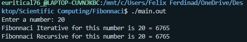
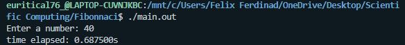
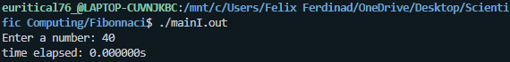
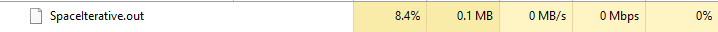

# Fibonnaci-benchmark

In this repository, I will compare the results of my space and time complexity for both methods of the Fibonnaci Sequence (Iterative and Recursive).

## Fibonnaci Iterative
```c
int FibonnaciIterative(int N){
    int f = 0, s = 1, results, i;
        for (int i = 0; i < N+1; i++)
        {
        if (i <= 1){
            results = i;
        }
        else{
            results = f + s;
            f = s;
            s = results;
        }
}
return results;
}
```
## Fibonnaci Recursive

```c
int FibonnaciRecursive(int N){
   if (N==0){
        return 0;
    }
    else if (N==1){
        return 1;
    }
    else{
        return FibonnaciRecursive(N-1)+FibonnaciRecursive(N-2);
    }
    
}
```
# Testing

## How to run code

Use the command below:

```
make; ./main.out
```

# Results 



# Benchmark Results

This benchmark shows the comparison between the time and space complexity of each of the fibonnaci results (iterative and recursive):

# Time Complexity

## How to run code

use the command below:

```
make time
```

# Comparison (Time Complexity)
In this case, the sample input N = 40



Fibonnaci Recursive Results



Fibonnaci Iterative Results

Conclusion: Time complexity of iterative is 0.00000s while the recursive is 0.687500s. In conclusion, the time complexity of iterative is less than recursive because the recursive sequence involves unnessary calls that increases its time complexity.

# Comparison (Space Complexity)
In this case, the sample input N = 10000


Fibonnaci Recursive Results



Fibonnaci Iterative Results

Conclusion: The space complexity of iterative is 0.1 MB while the recursive is 0.6MB, In conclusion, the space complexity of iterative is lesser compared to recursive due to unnecessary calls that happened in recursive which increases memory usage.